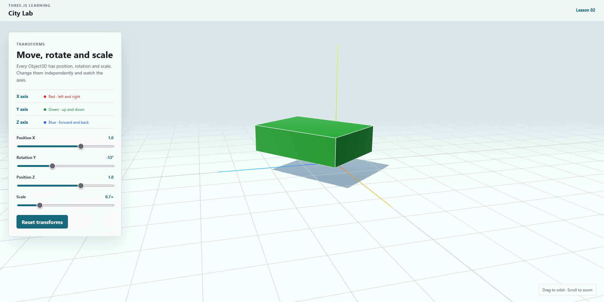

# Three.js Learning

A practical Three.js course built as a series of small interactive lessons.



## Lesson 01: The first scene

The first lesson introduces the four essentials:

- `Scene` stores the 3D world.
- `Camera` defines the point of view.
- `WebGLRenderer` draws the world to a canvas.
- The animation loop updates and redraws every frame.

## Lesson 02: Transformations

The second lesson adds interactive controls for the three transformations available on every `Object3D`:

- `position` moves an object along the X, Y and Z axes.
- `rotation` turns an object using radians.
- `scale` changes its size along each axis.

The lesson includes controls for X and Z movement, Y rotation, uniform scaling and resetting all transforms.

## Lesson 03: Geometry and materials

The third lesson compares several geometries and material models:

- `BufferGeometry` stores the vertices and faces of a shape.
- `Material` controls color and how a surface reacts to light.
- `Mesh` combines one geometry with one material.
- Roughness and metalness change the response of physically based materials.

## Run locally

```bash
npm install
npm run dev
```

Open the local URL printed by Vite, then drag to orbit and scroll to zoom.
